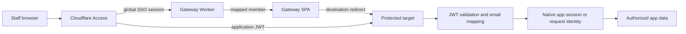

# House of EXP Cloudflare Access SSO Design

**Date:** 2026-07-16  
**Status:** Approved for implementation planning

## Goal

Replace the gateway's non-functional password check and the active applications' disconnected login gates with one production Cloudflare Access session for House of EXP staff. Aldi, Dissa, and Bil authenticate once, choose an application, and enter its authorized staff experience without another password prompt.

## Scope

The coordinated cutover covers:

- `Dash-exp` at `dash.houseofexp.com`
- Studio at `studio.houseofexp.com`
- Finance at `finance.houseofexp.com`
- Website Admin at `houseofexp.com/edit/`
- Client Portal staff administration at `client.houseofexp.com/admin`

Rental and Academy remain coming-soon destinations. Client Portal's external client login remains available outside Access. Machine-to-machine endpoints, including the Client Portal agent API, retain separate service authentication and are not converted into human SSO.

## Non-goals

- Building a custom production identity provider
- Storing production staff passwords in any House of EXP repository
- Replacing external Client Portal client accounts
- Giving every authenticated user every application role without an explicit mapping
- Treating frontend route guards or local storage values as authorization

## Current State

- The gateway accepts every non-empty password and redirects with an untrusted `gateway_user` query parameter.
- Studio verifies per-member password hashes in a Worker, issues an eight-hour HS256 token, and stores it in browser local storage.
- Finance compares a production password from a browser-bundled `VITE_APP_PASSWORD`, treats any non-empty local storage token as authenticated, and exposes Convex functions without server-side identity checks.
- Website Admin uses a password-derived, revocable D1-backed cookie. Its admin APIs call one `requireAdmin` seam, while `/edit` pages themselves are not server-guarded.
- Client Portal combines staff and external-client password login at `/`; its app session distinguishes `admin` and `client`, but middleware does not validate Cloudflare Access.

These mechanisms cannot provide central SSO. Finance's frontend-only gate is also not an authorization boundary.

## Chosen Architecture

Cloudflare Access is the production identity provider and edge policy engine. Each protected application also validates the Access application JWT or exchanges it into its native server-side session. This second check prevents application code from trusting spoofable identity headers or browser-controlled identity values.



### Why this architecture

1. **Access edge protection only** was rejected because target applications would still prompt for local passwords, and direct backend access—especially Convex—would remain inadequately authorized.
2. **A custom password broker** was rejected because it would make this project responsible for production password storage, recovery, revocation, token rotation, and cross-domain exchange.
3. **Access plus app-native identity bridges** reuses Cloudflare's global session while preserving each application's existing role and audit identifiers.

## Cloudflare Access Resources

Create self-hosted Access applications and reusable allow policies for:

| Resource | Protected path | Notes |
|---|---|---|
| Gateway | `dash.houseofexp.com/*` | Staff launcher and identity bootstrap |
| Studio | `studio.houseofexp.com/*` | SPA and same-origin `/api/*` Worker route |
| Finance | `finance.houseofexp.com/*` | SPA and same-origin auth bridge |
| Website Admin UI | `houseofexp.com/edit/*` | Public website remains unprotected |
| Website Admin API | `houseofexp.com/api/admin/*` | Defense in depth for all admin operations |
| Client staff UI | `client.houseofexp.com/admin*` | External client root remains unprotected by Access |
| Client admin API | `client.houseofexp.com/api/admin/*` | Staff-only mutations |
| Client admin upload | `client.houseofexp.com/api/media/upload-token` | Staff-only upload credential issuance |

The reusable policy is default-deny and allows only the three configured staff email addresses. Cloudflare Access One-Time PIN is the initial identity provider because it requires no new password database. A later Google or Microsoft identity provider can replace it without changing the application identity contract.

Use a 24-hour global session and an 8-hour application session for the initial rollout. Logout sends the browser to `/cdn-cgi/access/logout`, which clears the application authorization cookie; global logout uses the team-domain logout endpoint when the user explicitly chooses “log out everywhere.”

## Identity Contract

### Canonical staff identities

Application code uses the existing canonical member IDs:

```ts
type StaffId = "aldi" | "dissa" | "bil";
```

Studio keeps its existing database spelling `bill` through an explicit mapping from canonical `bil`; database IDs are not renamed during the SSO cutover.

Production email addresses are deployment configuration, not source constants:

```text
HOX_STAFF_ALDI_EMAIL
HOX_STAFF_DISSA_EMAIL
HOX_STAFF_BIL_EMAIL
```

Each value is normalized by trimming and lowercasing. Aliases and plus-address variants are not accepted implicitly. Missing configuration, duplicate email mappings, an absent email claim, or an unmapped email fails closed.

### Access JWT validation

Every server-side validator checks:

- RS256 signature against `https://${ACCESS_TEAM_DOMAIN}/cdn-cgi/access/certs`
- issuer equal to the configured Access team URL
- audience equal to that application's configured Access AUD tag
- token expiration and not-before claims
- canonical lowercased email mapping

The origin reads `Cf-Access-Jwt-Assertion`. Browser requests may also carry `CF_Authorization`, but application authorization never trusts an unsigned `Cf-Access-Authenticated-User-Email` header or a query parameter.

Access team domain and audience tags are required environment bindings. Production startup or request handling returns `503` when they are absent; it never falls back to local password mode.

The shared binding names are `ACCESS_TEAM_DOMAIN`, `ACCESS_AUDIENCE`, and the three `HOX_STAFF_*_EMAIL` values. `ACCESS_TEAM_DOMAIN` is the hostname ending in `.cloudflareaccess.com`, without a scheme. Each deployed application owns its own `ACCESS_AUDIENCE` value.

## Component Design

### Gateway (`Dash-exp`)

The gateway becomes a Cloudflare Worker-served SPA. The Worker serves static assets and owns the identity boundary:

- `GET /api/session` validates the Access assertion in production and returns only `{ staffId, name }`.
- `POST /api/session/login` exists only in explicit local mode and verifies the generated local test password server-side.
- `POST /api/session/logout` clears any local test session; production logout redirects through Cloudflare Access.

The production UI no longer asks users to claim an identity or enter a password. It hydrates the validated identity, highlights that user's existing shape, lets the user choose an application, and redirects using the fixed destination allowlist. `gateway_user` is removed from redirects.

Local mode retains the current identity selector and password field so the complete gateway interaction remains testable without a Cloudflare account session.

### Studio

Studio's Worker becomes the authorization source for both the SPA bootstrap and business APIs:

- Route the existing Worker under `studio.houseofexp.com/api/*` so Access and API calls are same-origin.
- Validate the Access JWT and map its email to the existing Studio member ID before serving protected APIs.
- `GET /api/auth/verify` returns the mapped member for frontend hydration.
- Business APIs derive `authenticatedMember` from the validated Access identity, never from a browser-provided member ID.
- The deployed frontend skips `LoginPage`; logout clears stale local tokens and uses Access logout.
- Existing password login and change-password paths are available only in explicit local mode.

### Finance

Finance requires both an Access edge gate and a Convex authorization boundary:

- Remove `VITE_APP_PASSWORD` and local-storage sentinel authentication from production.
- Add `POST /api/auth/token`, a same-origin endpoint that validates `Cf-Access-Jwt-Assertion` and returns a five-minute Finance bridge JWT containing `sub`, `staffId`, `email`, `iss`, `aud`, `iat`, and `exp`.
- Sign bridge tokens with RS256 using the private JWK in the server-only `FINANCE_AUTH_PRIVATE_JWK` secret and a stable `kid`.
- Publish only the corresponding public key from `GET /api/auth/.well-known/jwks.json`; this route is public so Convex can refresh signing keys.
- Use issuer `https://finance.houseofexp.com/api/auth` and audience `house-of-exp-finance`.
- Configure Convex `customJwt` with that exact issuer and application ID, the public JWKS URL, and `RS256`.
- Use `ConvexProviderWithAuth` to acquire and refresh the bridge token. Tokens stay in memory and are never written to local storage.
- Add one `requireStaffIdentity(ctx)` helper and call it from every public query, mutation, and action before data access.
- Keep a localhost-only server-verified password fallback for UI development; no `VITE_*` secret may participate in verification.

The token endpoint accepts only same-origin requests, returns `Cache-Control: no-store`, and never returns the Cloudflare assertion. The bridge narrows the credential to Finance Convex and limits replay exposure to five minutes. Convex's documented custom-JWT contract requires `kid`, `alg`, and `typ` headers plus `sub`, `iss`, and `exp` claims; `iat` supports client refresh behavior.

### Website Admin

Website Admin keeps its centralized `requireAdmin` seam:

- Add Access JWT validation and email mapping to `requireAdmin`.
- Protect both `/edit/*` and `/api/admin/*` with Access policies.
- Replace the deployed password form with identity/bootstrap and Access logout behavior.
- Preserve the existing D1-backed password session only in explicit local mode.
- Continue checking `requireAdmin` inside API and private-media handlers even though Access protects the path.

### Client Portal

Client Portal separates staff entry from external client entry:

- `/` continues to support external client username/password sessions.
- `/admin` is the gateway destination for House of EXP staff and is protected by Access.
- `GET /api/auth/access?returnTo=/admin` validates the Access JWT, maps the staff email, creates an `admin` app session with explicit `authSource: "cloudflare-access"` provenance, and redirects to the fixed same-origin `/admin` path. The handler rejects any other `returnTo` value.
- Existing `requireAdmin` checks continue to guard admin APIs.
- Client sessions can never be upgraded by a browser-supplied role or staff ID.
- The API-agent service key remains a separate machine credential and is reviewed independently from browser SSO.

## Local/Test Password Fallback

Implementation generates one cryptographically random password for each canonical staff identity. These passwords exist only to exercise local server-side login paths.

Rules:

- Plaintext values are shown once in the implementation handoff to the user.
- Repositories store only salted password verifiers in ignored local secret files.
- Local password endpoints require an explicit local mode and a localhost request.
- Production deployments reject local mode configuration.
- No password or verifier uses a `VITE_*`, `NEXT_PUBLIC_*`, or other browser-exposed variable.
- Passwords are reset or deleted after the Access rollout is verified.

The local passwords do not authenticate Cloudflare Access and are not a production recovery path.

## Error Handling

| Condition | Result |
|---|---|
| Missing or malformed Access assertion | `401` and Access re-authentication path |
| Invalid signature, issuer, audience, or time claim | `401`; no local fallback |
| Valid Access identity without staff mapping | `403` with a generic access-denied screen |
| Missing Access runtime configuration | `503`; fail closed |
| Finance bridge token expired | Refresh once through the same-origin bridge; otherwise sign out |
| External Client Portal user visits `/` | Existing client login remains available |
| Access-authenticated staff visits Client Portal `/admin` | Create or restore admin session; never use client credentials |
| Coming-soon destination selected | Keep the current in-page coming-soon state |

Authentication errors do not reveal whether an email or password exists. Logs record the application, canonical staff ID when available, outcome, and reason category without credentials or raw JWTs.

## Security Invariants

- Access policy is necessary but not sufficient; every protected backend validates identity.
- Authorization derives from validated server claims, never UI selection, URL parameters, or local storage.
- Every application validates its own audience tag.
- Identity mapping is explicit and fail-closed.
- Staff SSO and external client auth remain separate trust domains.
- Finance Convex functions reject unauthenticated direct calls.
- Local password mode cannot activate in production.
- Logout removes native app state and Cloudflare Access state deliberately.
- Secrets, raw tokens, and plaintext passwords never enter logs or committed files.

## Verification Strategy

### Unit and integration coverage

- Accept a correctly signed Access JWT with expected issuer, audience, expiry, and mapped email.
- Reject wrong signature, issuer, audience, expiry, missing email, duplicate mapping, and unmapped email.
- Confirm production refuses local password mode.
- Confirm generated local passwords succeed only on localhost and wrong passwords produce the same generic error.
- Confirm Studio APIs derive the existing member/audit ID from Access identity.
- Confirm every Finance Convex public function rejects a context without identity and accepts a mapped staff identity.
- Confirm Website `requireAdmin` accepts Access identity and still rejects revoked local sessions.
- Confirm Client Portal external clients cannot enter `/admin` and Access staff cannot become external clients implicitly.

### Browser smoke flows

1. Open the gateway unauthenticated and complete Access One-Time PIN login.
2. Verify the gateway displays the mapped staff identity without a production password prompt.
3. Open Studio, Finance, Website Admin, and Client Admin from the gateway and verify no second login prompt appears.
4. Exercise one authenticated read and one authorized write in each active staff application.
5. Open Client Portal `/` in a separate unauthenticated browser and verify external client login is unchanged.
6. Log out of one application, then log out globally and verify protected applications require Access again.
7. Run the gateway in local mode with each generated test password and verify production mode rejects those credentials.

## Rollout and Rollback

Roll out one Access application at a time to the three-user allowlist:

1. Gateway identity bootstrap
2. Studio same-origin Worker route and identity mapping
3. Website Admin path protection
4. Client Portal `/admin` split
5. Finance bridge and complete Convex authorization

Each target keeps its existing production login only until its Access bridge passes the browser smoke flow. Then production fallback is removed or disabled. Rollback disables that application's Access policy and restores its prior deployment; it does not broaden the Access allow policy or enable local password mode in production.

Finance ships last because adding real Convex authorization can expose hidden caller assumptions. Its rollout is complete only when direct unauthenticated Convex calls fail and the authenticated application still completes representative reads and writes.

## Acceptance Criteria

- Aldi, Dissa, and Bil authenticate once through Cloudflare Access and enter every authorized staff destination without a second password prompt.
- The gateway never accepts an arbitrary non-empty password or trusts a selected identity in production.
- All active staff backends derive identity from validated server-side claims.
- Finance data is inaccessible through unauthenticated direct Convex calls.
- Website public content and Client Portal external client login remain available without staff Access.
- Generated passwords work only in local mode and are absent from production bundles and committed files.
- Invalid, expired, mis-audienced, or unmapped identities fail closed.
- Logout and global logout behave as documented and are verified in a browser.

## References

- [Cloudflare Access session management](https://developers.cloudflare.com/cloudflare-one/access-controls/access-settings/session-management/)
- [Validate Cloudflare Access JWTs](https://developers.cloudflare.com/cloudflare-one/access-controls/applications/http-apps/authorization-cookie/validating-json/)
- [Cloudflare Access application tokens](https://developers.cloudflare.com/cloudflare-one/access-controls/applications/http-apps/authorization-cookie/application-token/)
- [Publish a self-hosted Access application](https://developers.cloudflare.com/cloudflare-one/access-controls/applications/http-apps/self-hosted-public-app/)
- [Convex custom JWT authentication](https://docs.convex.dev/auth/advanced/custom-jwt)
- [Convex custom authentication integration](https://docs.convex.dev/auth/advanced/custom-auth)
